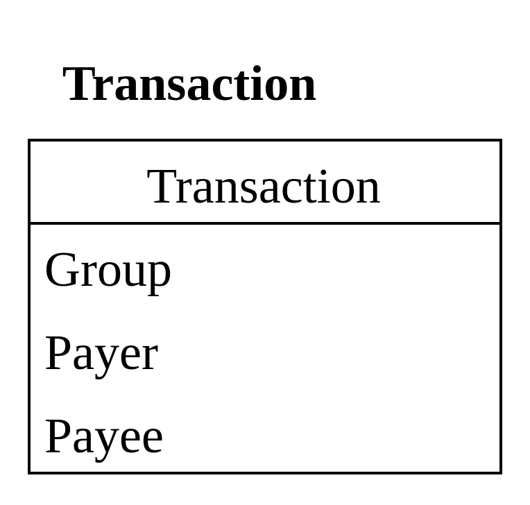

# Setu Design and coding challenge
### Problem statement:
Design an application which replicated the functionalities of splitwise.

### Requirements
1. Add users; Define groups; Assign users to groups.
 - user can be part of multiple groups.
 - No modification of Groups. (simplification)
2. User can add an expense related to a specific group
- Equal split -> all users on the group pay equally
- Exact split -> specify the amount each user pays
- Each expense if paid by single user (simplification)
3. User should be able to view all transactions along with pending amounts
- Filtered to a specific period
- Tagged to the group

### Desired endpoints

- Create user
- Create group with all the members
- Adding transactions
- List API to list all user group's transactions (with filters)

### My solution

To solve this problem, I have created a basic `node-express` application
that stores the tree in `Postgres` database using `Prisma` ORM.

---

## Prerequisites

This is a project build on the following tech stack, and are required to run the project

- `Nodejs-express`: run time environment to run our
  endpoints. I am using version v16.19.0 in my
  local machine but anything above v15 works just fine.

- `Postgres`: My design idea was to use a relational database.
  But I wanted the `SQL` database to have good writes and scalable.

This is all the prerequisites, everything else are just node packages

---
## Setup

### Install steps

- We start by installing all the dependencies using
```shell
npm install
```
- so we just have to create an `.env` file to store the database URL.

- Once that file is created we add our postgres database URL as `DATABASE_URL` in the file.

- Replace variables accordingly in the following URL

```env
DATABASE_URL="postgresql://${database user name}:${user password}@localhost:5432/${database name}?schema=public"
```

### Setup

- We start by setting up `Prisma` to generate the `PrismaClient()` using

```shell
npx prisma generate
```

- Now that we have prisma setup, we migrate our models to database using following command

```shell
npx prisma migrate deploy
```

- Everything is setup now, time to run the server

```shell
npm start
```

---

## Solution outline

Following is the directory structure of this project
```
-root/
  - __tests__/
  - controllers/
  - custom_error_handler/
  - input_schema/
  - postman_collection/
  - prisma/
  - routes/
  - utils/
  - app.js
  - jest.config.js
```

- I am attaching my postman collection for testing.
- `__tests__/` contains the test cases for this application
- I have used `yup` to serialize the input `POST body`

---
## Transaction Schema
To record a transaction, I am creating a `Transaction` table that is
```prisma
model Transaction {
  id               Int                @id @default(autoincrement())
  description      String
  createdAt        DateTime           @default(now())
  groupId          Int
  Group            Group              @relation(fields: [groupId], references: [id])
  payerId          Int
  Payer            User               @relation(fields: [payerId], references: [id])
  total            Int
  splitType        SplitType
  TransactionPayee TransactionPayee[]

  @@map(name: "tbl__transaction")
}
```


From the nature of our transaction, I know that all members are paying back but not the
person who paid for the transaction.
Now this model is extensible as well. We could have a transaction payers table that incorporates
payers record.

With that I have created a `TransactionPayee` table with following schema
```prisma
model TransactionPayee {
  id            Int         @id @default(autoincrement())
  payeeId       Int
  Payee         User        @relation(fields: [payeeId], references: [id])
  amount        Int
  transactionId Int
  Transaction   Transaction @relation(fields: [transactionId], references: [id])

  @@map(name: "tbl__transaction_payee")
}


```
Example:


---

## Endpoint

My solution has 4 endpoints

```
/user/ POST to create user
/group/ POST to create group
/transaction/ POST to create a transaction
/transaction/:userId/ Get to get all user's transactions
```
Postman schema has example calls as well

### Creating user

```
POST @http://localhost:8080/user/
{
    "name": "Jane deor",
    "email": "janedeor@gmail.com"
}
```

### Creating group

```
POST @http://localhost:8080/group/
{
	"name": "Jane's villa",
	"users": [7, 8]
}
```
### Creating transactions
In case of "EXACT" split, we send a dictionary `payeeMap` of type
```
{
	userId: amount
}
```
While in case of "EQUAL" split, these's no need to send `payeeMap`
```
POST @http://localhost:8080/transaction/
{
      "groupId": 7,
      "description": "lunch",
      "payerId": 7,
      "total": 200,
      "splitType": "EXACT",
      "payeeMap": { "7": 140, "8": 60 }
}
```
### Listing user's transactions
To list all the user's transactions from all his/her group, we use this API.
Output of this API will give use all the transactions with groups.
```
GET @http://localhost:8080/transactions/:userId

```

##### Extending List to filter date and groupId

As mentioned in section 3, I have extended transactions list API with
`groupId`, `startDate` and `endDate` query parameters.

e.g. To filter transactions list for `userId = 2` to only show items from `groupID=2`
```
GET http://localhost:8080/transactions/2/?groupId=2
```

e.g. To filter all transactions for `userId=2` that happened between 21st August to 22nd August,
```
GET http://localhost:8080/transactions/7/?startDate=2023-08-21&endDate=2023-08-22
```

---

## Unit test

To test our API endpoints, I have added test cases using `supertest`
and `jest`(jest was pre-installed).

As standards, I am using a test database to test my APIs and clearing all the data at end.

To run the cases you have to create a separate database and add it's `URL` and `name` to
out `env` file. e.g.

```
TEST_DATABASE_URL="postgresql://${database user name}:${user password}@localhost:5432/${test database name}?schema=public"
```

Once that is done we could run our test cases bu entering the following command

```shell
npm test
```

##### Important information

To run our test cases and point to test database for APIs, I have created a `testPrisma` instance
which I am using based on the `process.env.NODE_ENV`.

More details on this can be found in `prisma/get_prisma_client.js`

##### Coverage of test case
In our test we are covering `User`, `Group` and `Transaction` scenarios. 
Individual test cases are as follows:

- User
```
1. Create User test case, gives 201 on success
2. Invalid request if "name" or "email" is not provided
```

- Group
```
1. Create group test case, gives 201 on success
2. Create group fails if an unknown user is sent in users:[]
3. Invalid request if "name" or "users" is not provided
```

- Transactions
```
1. Create transaction test case with split type exact, gives 201 on success
2. Create transaction test case with split type equal, gives 201 on success
2. Create transaction with split type exact fails when all the indivual 
   values do not add up to total
4. Invalid request if required parameters are not provided
```
---

